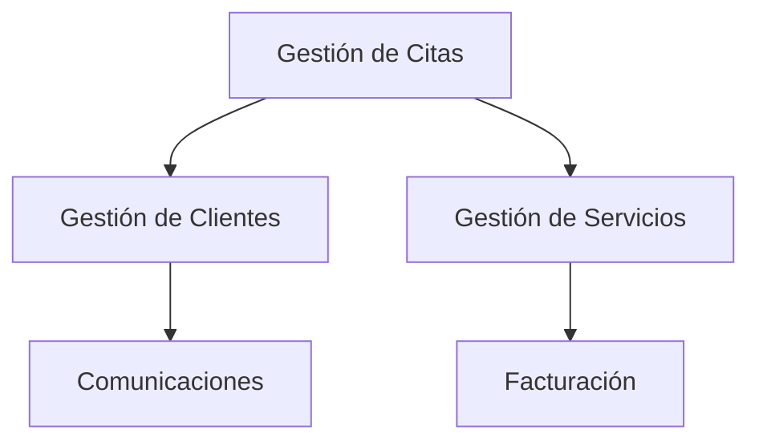

# Domain-Driven Design (DDD)

## Introducción

El Domain-Driven Design es una metodología de desarrollo de software que se centra en la comprensión profunda del negocio y su modelado en el código. Este enfoque ayuda a crear sistemas más mantenibles y alineados con las necesidades del negocio.

## Conceptos Principales

### 1. Dominio

El dominio es el área de conocimiento o actividad del negocio. En el caso de una peluquería, el dominio incluye:

- Gestión de citas
- Gestión de clientes
- Servicios ofrecidos
- Horarios y disponibilidad
- Facturación y pagos

### 2. Modelo de Dominio

Es una representación abstracta del dominio que captura la esencia de los conceptos del negocio. En tu caso, el modelo de dominio podría incluir:

#### Entities (Entidades)

```typescript
interface Cliente {
  id: string
  nombre: string
  telefono: string
  email: string
  preferencias: PreferenciasCliente
}

interface Servicio {
  id: string
  nombre: string
  duracion: Duracion
  precio: Precio
  descripcion: string
}

interface Reserva {
  id: string
  cliente: Cliente
  servicio: Servicio
  horario: Horario
  estado: EstadoReserva
}
```

#### Value Objects (Objetos de Valor)

```typescript
interface Duracion {
  horas: number
  minutos: number
}

interface Precio {
  monto: number
  moneda: string
}

interface Horario {
  fecha: Date
  horaInicio: string
  horaFin: string
}
```

### 3. Contextos y Contextos delimitados

#### Contexto de Gestión de Citas

- Responsable de la agenda y programación
- Maneja la disponibilidad de horarios
- Gestiona las reservas y cancelaciones

#### Contexto de Gestión de Clientes

- Maneja el registro y perfil de clientes
- Mantiene las preferencias y historial
- Gestiona las comunicaciones

#### Contexto de Gestión de Servicios

- Define los servicios disponibles
- Maneja precios y duraciones
- Gestiona promociones y paquetes

### 4. Aggregates (Agregados)

```typescript
// Aggregate Reserva
interface ReservaAggregate {
  id: string
  cliente: Cliente
  servicio: Servicio
  horario: Horario
  estado: EstadoReserva

  // Métodos de negocio
  reservar(): void
  cancelar(): void
  reprogramar(nuevoHorario: Horario): void
  confirmar(): void
}
```

### 5. Repositorios

```typescript
interface IReservaRepository {
  guardar(reserva: Reserva): Promise<void>
  buscarPorId(id: string): Promise<Reserva>
  buscarPorCliente(idCliente: string): Promise<Reserva[]>
  buscarPorFecha(fecha: Date): Promise<Reserva[]>
}
```

### 6. Domain Events (Eventos de Dominio)

```typescript
interface ReservaCreada {
  idReserva: string
  idCliente: string
  idServicio: string
  fecha: Date
}

interface ReservaCancelada {
  idReserva: string
  fechaCancelacion: Date
  motivo: string
}
```

## Principios Fundamentales

### 1. Ubiquitous Language

Es un lenguaje común que debe ser compartido entre desarrolladores y expertos del negocio. Ejemplos:

- "Reserva" no es "Cita"
- "Servicio" no es "Tratamiento"
- "Cliente" no es "Usuario"

### 2. Context Mapping

Mapeo de cómo diferentes contextos se relacionan:



## Implementación Práctica

### Ejemplo de Servicio de Dominio

```typescript
class ServicioReservas {
  constructor(
    private readonly reservaRepo: IReservaRepository,
    private readonly clienteRepo: IClienteRepository,
  ) {}

  async crearReserva(idCliente: string, idServicio: string, horario: Horario): Promise<Reserva> {
    const cliente = await this.clienteRepo.buscarPorId(idCliente)
    const reserva = new ReservaAggregate({
      id: uuid(),
      cliente,
      servicio: await this.obtenerServicio(idServicio),
      horario,
      estado: 'pendiente',
    })

    await this.reservaRepo.guardar(reserva)
    return reserva
  }

  private async obtenerServicio(idServicio: string): Promise<Servicio> {
    // Lógica para obtener el servicio
  }
}
```

### Ejemplo de Evento de Dominio

```typescript
class ManejadorReservaCreada {
  constructor(private readonly servicioNotificaciones: INotificacionService) {}

  async manejar(evento: ReservaCreada): Promise<void> {
    const cliente = await this.clienteRepo.buscarPorId(evento.idCliente)
    await this.servicioNotificaciones.enviarNotificacion(
      cliente.email,
      `Tu reserva para ${evento.fecha} ha sido creada con éxito`,
    )
  }
}
```

## Beneficios de Implementar DDD

1. **Separación de Responsabilidades**

   - Cada componente tiene una única responsabilidad
   - Mejor mantenibilidad del código
   - Facilita la prueba unitaria

2. **Modelo de Dominio Rico**

   - El código refleja directamente los conceptos del negocio
   - Mejor comprensión del sistema
   - Código más intuitivo

3. **Evolución del Sistema**

   - Facilidad para agregar nuevas funcionalidades
   - Mejor manejo de cambios en el negocio
   - Menor impacto en cambios

4. **Comunicación Mejorada**
   - Lenguaje común entre desarrolladores y negocio
   - Reducción de malentendidos
   - Documentación viva en el código

## Consideraciones para Implementar en tu Proyecto

1. **Comienza Pequeño**

   - Implementa DDD en un módulo específico
   - Aprende de la experiencia
   - Escala gradualmente

2. **Enfoque en el Núcleo del Dominio**

   - Identifica las partes críticas del negocio
   - Prioriza el modelado de estas áreas
   - No intentes modelar todo desde el principio

3. **Evoluciona el Modelo**

   - El modelo de dominio crecerá y cambiará
   - Mantén la flexibilidad
   - Refactoriza cuando sea necesario

4. **Mantiene la Consistencia**
   - Usa el mismo lenguaje en todo el código
   - Mantén las reglas de negocio consistentes
   - Documenta las decisiones importantes

## Ejemplo Completo de un Aggregate

```typescript
// Aggregate Reserva
export class ReservaAggregate {
  private _id: string
  private _cliente: Cliente
  private _servicio: Servicio
  private _horario: Horario
  private _estado: EstadoReserva

  constructor(props: ReservaProps) {
    this._id = props.id
    this._cliente = props.cliente
    this._servicio = props.servicio
    this._horario = props.horario
    this._estado = props.estado
    this.validate()
  }

  private validate(): void {
    if (!this._cliente) throw new Error('Cliente es requerido')
    if (!this._servicio) throw new Error('Servicio es requerido')
    if (!this._horario) throw new Error('Horario es requerido')
  }

  get id(): string {
    return this._id
  }

  get cliente(): Cliente {
    return this._cliente
  }

  get servicio(): Servicio {
    return this._servicio
  }

  get horario(): Horario {
    return this._horario
  }

  get estado(): EstadoReserva {
    return this._estado
  }

  // Comportamiento del dominio
  reservar(): void {
    if (this._estado !== 'pendiente') {
      throw new Error('La reserva ya ha sido procesada')
    }
    this._estado = 'confirmada'
  }

  cancelar(motivo: string): void {
    if (this._estado !== 'confirmada') {
      throw new Error('Solo se pueden cancelar reservas confirmadas')
    }
    this._estado = 'cancelada'
    // Generar evento de cancelación
    this.emitirEvento(
      new ReservaCancelada({
        idReserva: this._id,
        fechaCancelacion: new Date(),
        motivo,
      }),
    )
  }

  private emitirEvento(evento: DomainEvent): void {
    // Implementación de emisión de eventos
  }
}
```

## Recomendaciones Finales

1. **Educación y Capacitación**

   - Capacita a todo el equipo sobre DDD
   - Mantén sesiones de aprendizaje continuo
   - Documenta las decisiones importantes

2. **Herramientas y Patrones**

   - Usa patrones como Factory para crear objetos complejos
   - Implementa Repository para acceso a datos
   - Usa Specifications para reglas de negocio complejas

3. **Mantenimiento**

   - Refactoriza regularmente
   - Mantiene la documentación actualizada
   - Revisa periódicamente la alineación con el negocio

4. **Evolución**
   - El modelo de dominio debe evolucionar con el negocio
   - Mantén la flexibilidad en el diseño
   - Aprende de los cambios y ajusta el modelo

Este documento proporciona una visión completa de cómo implementar DDD en tu proyecto de peluquería. Cada concepto está respaldado con ejemplos prácticos y código real que puedes usar como base para tu implementación.

¡Espero que esta guía te sea útil para implementar DDD en tu proyecto de manera efectiva!
