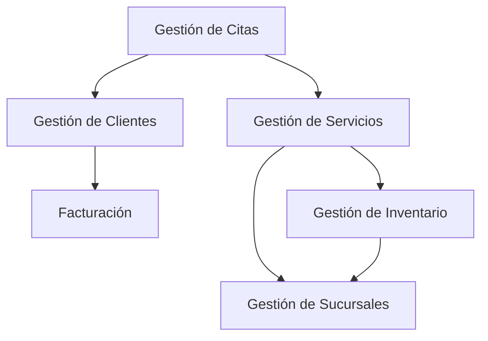

# Análisis de Dominio y Subdominios para Peluquería Moderna

## 1. Problema a Resolver

### Contexto Actual
Peluquería Moderna enfrenta varios desafíos operativos que requieren una solución tecnológica integral:

1. **Facturación Manual**
   - Sistema actual ineficiente y propenso a errores
   - Dificultad en el seguimiento de ventas y reportes
   - Falta de integración con otros sistemas

2. **Gestión de Clientes**
   - Clientela diversa de toda la ciudad
   - Necesidad de seguimiento personalizado
   - Programa de fidelización manual

3. **Expansión de Sucursales**
   - Plan de apertura de múltiples ubicaciones
   - Necesidad de gestión centralizada
   - Coordinación entre sedes

4. **Inventario de Productos**
   - Amplia gama de productos de belleza
   - Gestión de stock compleja
   - Necesidad de reabastecimiento eficiente

5. **Personal y Recursos**
   - Personal administrativo y técnico
   - Gestión de horarios y turnos
   - Planificación de personal adicional en fechas especiales

## 2. Extracción de Dominios y Subdominios

### Core Domain (Dominio Principal)

#### Gestión de Citas y Servicios
- **Descripción**: Núcleo operativo de la empresa
- **Responsabilidades**:
  - Sistema de agenda centralizado
  - Gestión de citas por sucursal
  - Sistema de reservas y cancelaciones
  - Gestión de horarios y turnos
  - Planificación de personal

### Generic Domain (Dominio Genérico)

#### Gestión de Clientes
- **Descripción**: Manejo de información y experiencia del cliente
- **Responsabilidades**:
  - Base de datos de clientes
  - Programa de fidelización
  - Historial de servicios
  - Preferencias y alergias
  - Comunicaciones

#### Facturación y Pagos
- **Descripción**: Sistema financiero de la empresa
- **Responsabilidades**:
  - Emisión de facturas
  - Sistema de pagos
  - Reportes financieros
  - Gestión de promociones

### Support Domain (Dominio de Apoyo)

#### Gestión de Inventario
- **Descripción**: Control de productos y suministros
- **Responsabilidades**:
  - Catálogo de productos
  - Stock por sucursal
  - Sistema de pedidos
  - Proveedores
  - Reabastecimiento

#### Gestión de Sucursales
- **Descripción**: Coordinación entre sedes
- **Responsabilidades**:
  - Configuración de sucursales
  - Distribución de recursos
  - Reportes por sede
  - Gestión de personal por ubicación

## 3. Integración entre Subdominios

## 4. Reglas de Negocio Críticas

1. **Gestión de Horarios**
   - No se pueden superponer citas
   - Tiempo mínimo entre servicios
   - Gestión de turnos por sucursal
   - Planificación especial para fechas festivas

2. **Gestión de Clientes**
   - Historial completo de servicios por sucursal
   - Preferencias y alergias actualizadas
   - Programa de fidelización por ubicación
   - Comunicaciones personalizadas

3. **Gestión de Inventario**
   - Stock mínimo por producto
   - Alertas de reabastecimiento
   - Distribución entre sucursales
   - Control de vencimientos

4. **Facturación**
   - Facturas por sucursal
   - Promociones y combos
   - Reportes financieros consolidados
   - Gestión de pagos

## 5. Ubiquitous Language

| Concepto | Definición |
|----------|------------|
| Reserva | Programación confirmada de un servicio en una sucursal específica |
| Cita | Horario reservado en la agenda de una sucursal |
| Cliente | Persona que recibe servicios en cualquier sucursal |
| Servicio | Tratamiento o procedimiento ofrecido en la peluquería |
| Agenda | Sistema de gestión de horarios por sucursal |
| Sucursal | Ubicación física de la empresa |
| Factura | Documento que registra una transacción en una sucursal |
| Promoción | Oferta especial disponible en una o más sucursales |
| Inventario | Stock de productos disponibles por sucursal |

## 6. Contextos delimitados

### Contexto de Gestión de Citas
- Responsabilidades: Agenda, reservas, horarios por sucursal
- Límites: Solo maneja la parte de programación
- Integraciones: Con clientes y servicios

### Contexto de Gestión de Clientes
- Responsabilidades: Perfiles, preferencias, historial
- Límites: No maneja pagos ni reservas
- Integraciones: Con comunicaciones y fidelización

### Contexto de Facturación
- Responsabilidades: Emisión y seguimiento de facturas
- Límites: Solo maneja transacciones
- Integraciones: Con servicios y clientes

### Contexto de Inventario
- Responsabilidades: Control de stock y pedidos
- Límites: Solo maneja productos
- Integraciones: Con proveedores y reabastecimiento

Este análisis proporciona una visión completa de los desafíos operativos de la empresa y cómo estructurar el sistema para resolverlos de manera eficiente y escalable.
